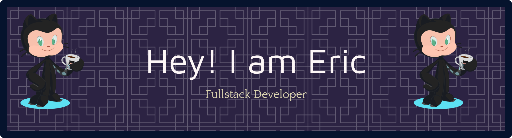
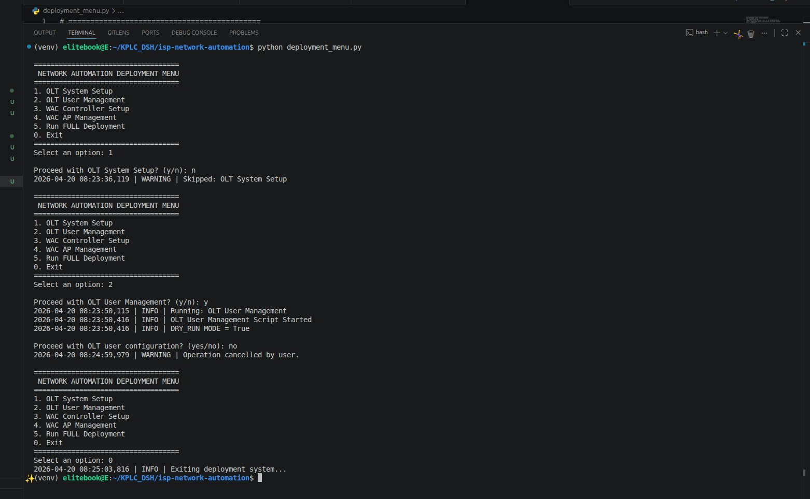
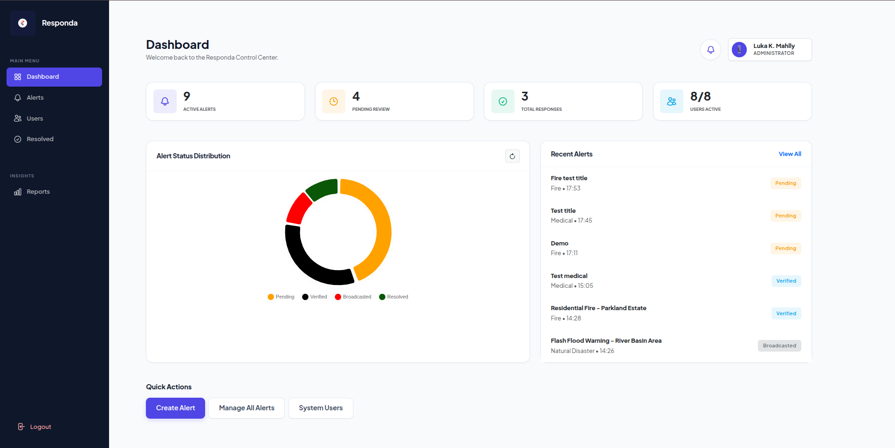
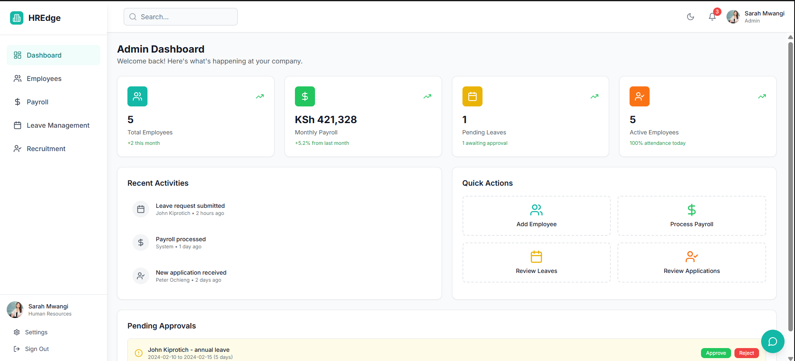
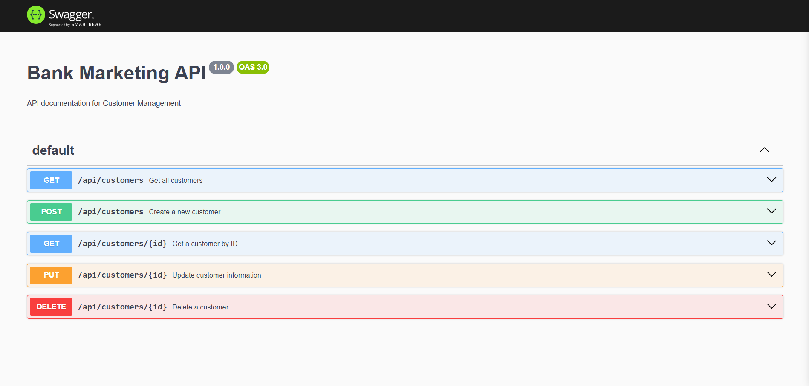
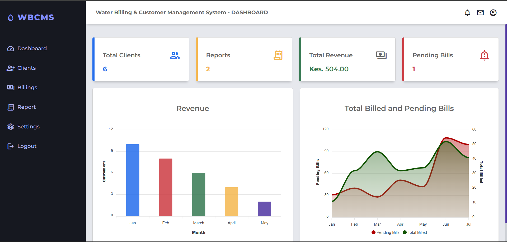

> # Hi, I'm Eric Nzyoka 👋
**Software & Systems Developer | Full-Stack Developer | Backend Enthusiast**

- Based in Nairobi, Kenya  
- Building **robust, scalable, and user-focused systems**  
- Passionate about solving real-world problems and automating workflows  

## Currently Learning
**Generative AI – Building Generative AI Applications**  
- Hands-on projects creating text, images, music, and video with AI  
- Using BCS Jaseci Lab ecosystem for practical experience  
- Preparing for high-impact AI roles in healthcare, finance, and agriculture  

## Technologies & Skills

### 🔹 Programming & Development
 
 
 
 
 
 
 
 
 
 
 

### 🔹 Databases & Tools
 
 
 
 
 
 
 
 
 
 
 

## Featured Projects

### ISP Network Automation Framework (OLT + WAC)

A network automation system designed for ISP infrastructure deployment in Kenya.

- **Features:** 
  - Automated OLT & WAC configuration
  - VLAN segmentation, user provisioning
  - SSH setup, CAPWAP AP management
  - full ISP deployment workflow with confirmation-based execution.

🔗 **View** [project repository](https://github.com/nzyoka500/isp-network-automation)

  

----

### Responda – Community Emergency Alert & Response System
 
 
 
  

- Role-based web & mobile platform for managing emergency alerts in real time  
- Admin dashboard, secure user management, planned Firebase notifications  

🔗 **View** [project repository](https://github.com/nzyoka500/emergency-alert-system) 

<!-- Project image -->

----

### **HREdge – Smart HR Platform for Kenyan SMEs**

A Human Resources platform designed for SMEs in Kenya.  

- Features: 
  - Payroll (with M-Pesa), 
  - AI recruitment
  - leave management
  - chatbot support
  - Mobile-first design.  

<!-- Project image -->

### Database Optimization – Bank Marketing API
 
 
 
  

- Optimized PostgreSQL schema, CRUD RESTful API, automated triggers  
- Reduced query times: 1.2s → 0.05s, API response: 800ms → 300ms  

**View** [project repository](https://github.com/nzyoka500/database-optimization-project) 🔗

<!-- Project image -->

### Water Billing & Customer Management System
 
  

- Billing & customer management system for SMEs  
- Secure data handling, bill calculations, structured storage 

🔗 **View** [project repository](https://github.com/nzyoka500/water-billing)

<!-- Project image -->

## GitHub Activity
<picture>
  <source media="(prefers-color-scheme: dark)" srcset="https://raw.githubusercontent.com/nzyoka10/nzyoka10/output/github-snake-dark.svg" />
  <source media="(prefers-color-scheme: light)" srcset="https://raw.githubusercontent.com/nzyoka10/nzyoka10/output/github-snake.svg" />
  
</picture>