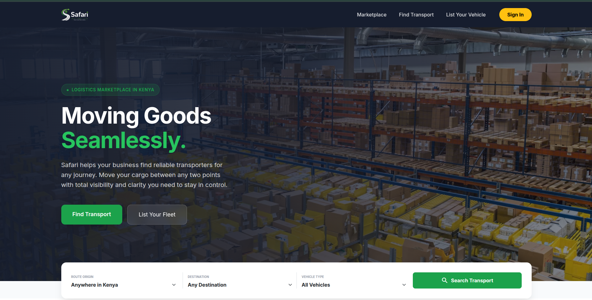

# Hi, I'm Eric Nzyoka 👋

### Software Engineer | IT & Technology

I build software, support IT systems, and use technology to solve real-world problems.

📍 Nairobi, Kenya

## About Me

I am a software and IT professional with experience building applications, supporting users, managing systems, and working with cloud and infrastructure.

I enjoy learning, solving problems, and turning ideas into useful solutions.

My work includes:
- Software & Full-Stack Development
- Web Applications
- AI & Automation
- Cloud & Linux
- IT Support & Infrastructure
- Systems Administration

I am open to opportunities where I can learn, contribute, and grow while helping a team solve real problems.

## Skills

- Build and maintain software systems
- Develop websites and web applications
- Work with backend systems, databases and APIs
- Support Linux, servers and networks
- Build AI and automation solutions
- Troubleshoot technical problems
- Work well with teams and users

# Tech Stack

# Featured Projects

### Safari - Transport Services Marketplace

A digital marketplace that connects customers with transport providers across East Africa. The platform makes it easier for people and businesses to find transport services, send requests, and connect with providers in one place.

### My Contributions
- Designed and developed the platform from the ground up
- Built the customer, transport provider, and admin sides
- Designed the database and main system structure
- Built service search, requests, and provider management
- Developed the backend and connected the different parts of the platform
- Tested and improved the system based on user needs

### Tech Stack
PHP • MySQL • HTML • CSS • JavaScript

- **View Demo:** https://safari-mvp.ct.ws/

## Marketplace Website User Interface

Built the frontend for a service marketplace that helps users find and book trusted service providers.

### Highlights
- Modern and responsive UI
- Fast and user-friendly experience
- Service search interface
- Mobile-first design

### Tech Stack
React • Tailwind CSS • JavaScript

- **View Demo:** https://tinyurl.com/yj49n276

## Akiba Sentinel

**Helps financial institutions notice unusual account activity early.**

### What Akiba Does

- Learns normal account activity
- Notices unusual changes
- Sends early alerts
- Supports better decisions
- Works with your existing system

### Tech Stack
Python • FastAPI • PostgreSQL • Docker

- **View Demo:** N/A

## ISP Network Automation

Helps internet service providers set up and manage their networks faster and more consistently.

### What It Does
- Speeds up network setup
- Reduces manual work
- Minimizes setup errors
- Makes it easier to manage network growth

### Tech Stack
Python • Netmiko • Cisco Networking

- **Repo:** https://github.com/nzyoka500/isp-network-automation

## Responda – Emergency Response Platform

A platform that helps emergency teams communicate, coordinate, and respond faster during critical situations.

### What It Does
- Speeds up emergency response
- Keeps teams coordinated
- Works on both mobile and web
- Makes critical information easy to access

### Tech Stack
PHP • MySQL • JavaScript

- **Repo:** https://github.com/nzyoka500/emergency-alert-system

## Database Optimization – Banking API

Improved a banking database system by making it faster, more reliable, and able to handle requests more efficiently.

### Results
- Reduced query time from 1.2s to 0.05s
- Faster API responses
- Improved overall system performance

### Tech Stack
Node.js • Express • PostgreSQL

- **Repo:** https://github.com/nzyoka500/database-optimization-project

# Currently Learning

- Cloud Infrastructure & Deployment
- Scalable System Design
- Backend Performance Optimization
- DevOps & Containerization
- Networking & CCNA Path

# GitHub Activity

<picture>
  <source media="(prefers-color-scheme: dark)" srcset="https://raw.githubusercontent.com/nzyoka10/nzyoka10/output/github-snake-dark.svg" />
  <source media="(prefers-color-scheme: light)" srcset="https://raw.githubusercontent.com/nzyoka10/nzyoka10/output/github-snake.svg" />
  
</picture>

# Let’s Connect

**Email:** mnzyokaeric@gmail.com  
**LinkedIn:** https://linkedin.com/in/ericnzyoka  

> *I enjoy collaborating on software, backend, infrastructure, and automation projects that solve real-world problems.*